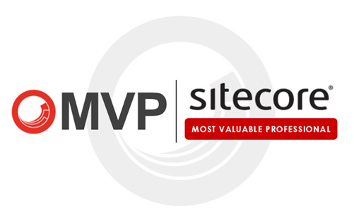

# Hi, my name is Borja Prado 👋
### Specialist Solutions Architect @ AWS

I´m Senior Specialist Solutions Architect at AWS for Microsoft technologies, leading modernization activities of windows-based workloads in EMEA.  

I'm passionate about multicloud environments, complex cross-cloud migrations, web architectures and application modernization, helping customers to build scalable solutions with .NET on AWS. 

Outside work, you can find me traveling the world or trying asian food (specially thai ;D).

## Awards
<table><tr align="center">
<td valign="top"> 
        
👥 [Sitecore MVP](https://mvp.sitecore.com/Directory?q=borja%20prado&fc_Year=2022) (Most Valuable Professional) 2022

👥 [Sitecore MVP](https://mvp.sitecore.com/Directory?q=borja%20prado&fc_Year=2021) (Most Valuable Professional) 2021

👥 [Sitecore MVP](https://mvp.sitecore.com/Directory?q=borja%20prado&fc_Year=2020) (Most Valuable Professional) 2020

👥 [Sitecore MVP](https://mvp.sitecore.com/Directory?q=borja%20prado&fc_Year=2019) (Most Valuable Professional) 2019
</td>
<td valign="top"> 
      
👥 [CodeProject Top Author](https://www.codeproject.com/script/Membership/View.aspx?mid=8606340)

👥 [Best Mobile Article of July 2014](https://www.codeproject.com/Competitions/750/Best-Mobile-Article-of-July-2014)
</td>
</tr>
</table>

## Content

- [Standardizing CI/CD pipelines for .NET web applications with AWS Service Catalog](https://aws.amazon.com/blogs/devops/standardizing-cicd-pipelines-net-web-applications-aws-service-catalog/)

- [LeasePlan Sitecore Implementation with Amazon EKS](https://aws.amazon.com/blogs/architecture/leaseplan-sitecore-implementation-with-amazon-eks/)

##

- [Sitecore on AWS Reference Deployment](https://aws.amazon.com/solutions/partners/sitecore-xp)

- [Sitecore on AWS QuickStart Templates](https://github.com/aws-ia/cfn-ps-aws-ec2-sitecore-xp)

##

- [Discovering the Vine API (April 2015)](http://www.codeproject.com/Articles/893709/Discovering-the-Vine-API)

- [Windows Phone 8.1 Media Editing API (July 2014)](http://www.codeproject.com/Articles/795003/Windows-Phone-Media-Editing-API)

- [WinRT Apps Exception Logging (Dec 2013)](http://www.codeproject.com/Articles/690019/WinRT-Apps-Exception-Logging)

## Projects

