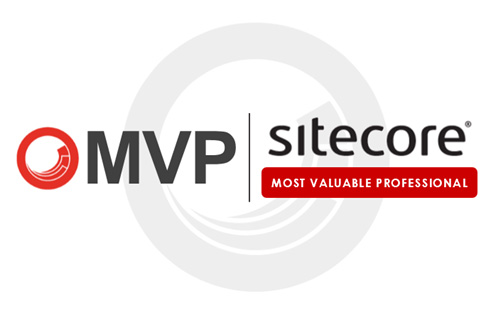

# Hi, my name is Borja Prado 👋
### Principal Solutions Architect @ AWS

I´m Principal Infrastructure Migration and Modernization Solutions Architect at AWS, leading large-scale migrations and modernization activities across EMEA.  

I'm passionate about multicloud environments, complex cross-cloud migrations, AI, and application modernization, helping customers to build scalable solutions on AWS. 

Outside work, you can find me traveling the world or trying asian food (specially thai ;D).

## Tech
<table width="50%"><tr align="center">
<td valign="top" width="33%"> 

👥 Principal Solutions Architect
</td>

<td valign="top" width="33%">         

👥 [Sitecore MVP](https://mvp.sitecore.com/en/Directory/Profile?id=71c35bbd22cb4bdc58dc08dacb4853b0) 2022

👥 [Sitecore MVP](https://mvp.sitecore.com/en/Directory/Profile?id=71c35bbd22cb4bdc58dc08dacb4853b0) 2021

👥 [Sitecore MVP](https://mvp.sitecore.com/en/Directory/Profile?id=71c35bbd22cb4bdc58dc08dacb4853b0) 2020

👥 [Sitecore MVP](https://mvp.sitecore.com/en/Directory/Profile?id=71c35bbd22cb4bdc58dc08dacb4853b0) 2019
</td>

<td valign="top" width="33%"> 
👥 CodeProject Top Author 
 
For years this site has been a haven for developers, and as top contributor it's sad to see the shutdown of CodeProject
</td>
</tr>
</table>
 

## Content

### Azure to AWS
- [Migrate Azure SQL Managed Instance to Amazon RDS for SQL Server](https://aws.amazon.com/blogs/modernizing-with-aws/migrate-azure-sql-managed-instance-to-amazon-rds-for-sql-server-with-byom/)
  
### Sitecore on AWS
- [Sitecore on AWS Deployment Guide](https://aws-ia.github.io/cfn-ps-aws-ec2-sitecore-xp/)

- [Sitecore on AWS QuickStart Templates](https://github.com/aws-ia/cfn-ps-aws-ec2-sitecore-xp)

### CodeProject (CodeProject has been shutdown so there's no access to its content anymore)

- WinRT Apps Exception Logging

- Windows Phone 8.1 Media Editing API

- Discovering the Vine API

- ..and more!
 

## Projects

TO-DO

